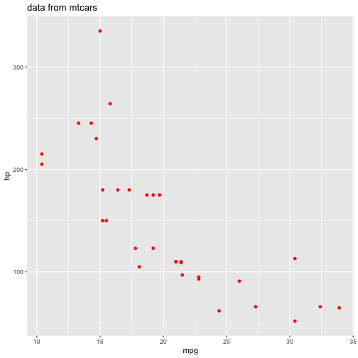
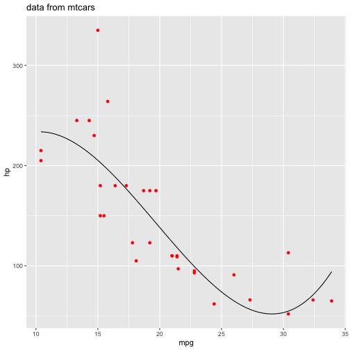
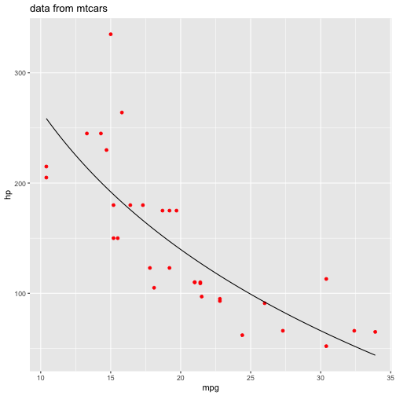

Fitting Data from mtcars
========================================================
author: Igor Gamayun
date: 16.05.2022
autosize: true
transition: rotate
font-family: 'Helvetica'


What does this App do
========================================================

This App uses mtcars daraset to create a fit between variables in mtcars and then predict a value of a chosen variable.  
The X and Y variables can be chosen from pop-up menu.  

```
 [1] "mpg"  "cyl"  "disp" "hp"   "drat" "wt"   "qsec" "vs"   "am"   "gear"
[11] "carb"
```


Example: Y=hp plotted versus X=mpg
========================================================

***
Fitting can be done with: 

- Linear fit
- Second degree polynomial fit
- Third degree polynomial fit
- Exponential fit


Example: 
========================================================

Third degree polynomial fitting


```
[1] "R^2= 0.6874"
```
***
Exponential fitting


```
[1] "R^2= 0.6233"
```


Value prediction of the chosen fitting
========================================================

prediction of the hp value for mpg=16


***

```
[1] "R^2= 0.6874"
```

```
[1] "predicted value of hp is 193.64"
```

Conclusion
- choose X and Y from mtcars
- try to use different fit methods 
- choose one with the highest R^2
- enter the value either with a slide or in a text box
- the App will predict the output value
